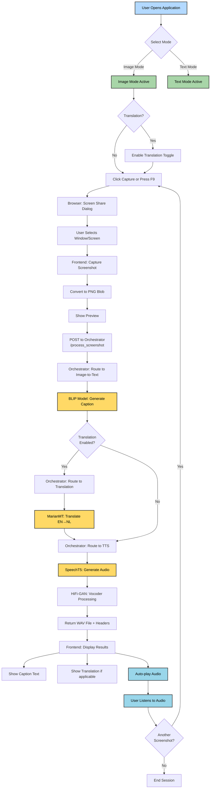
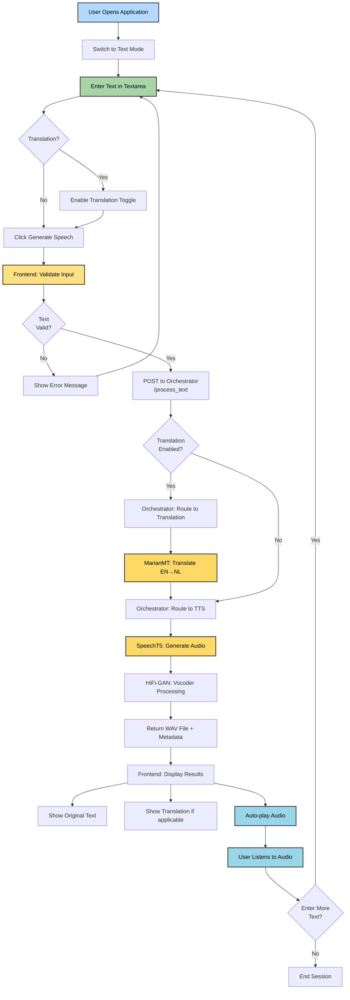
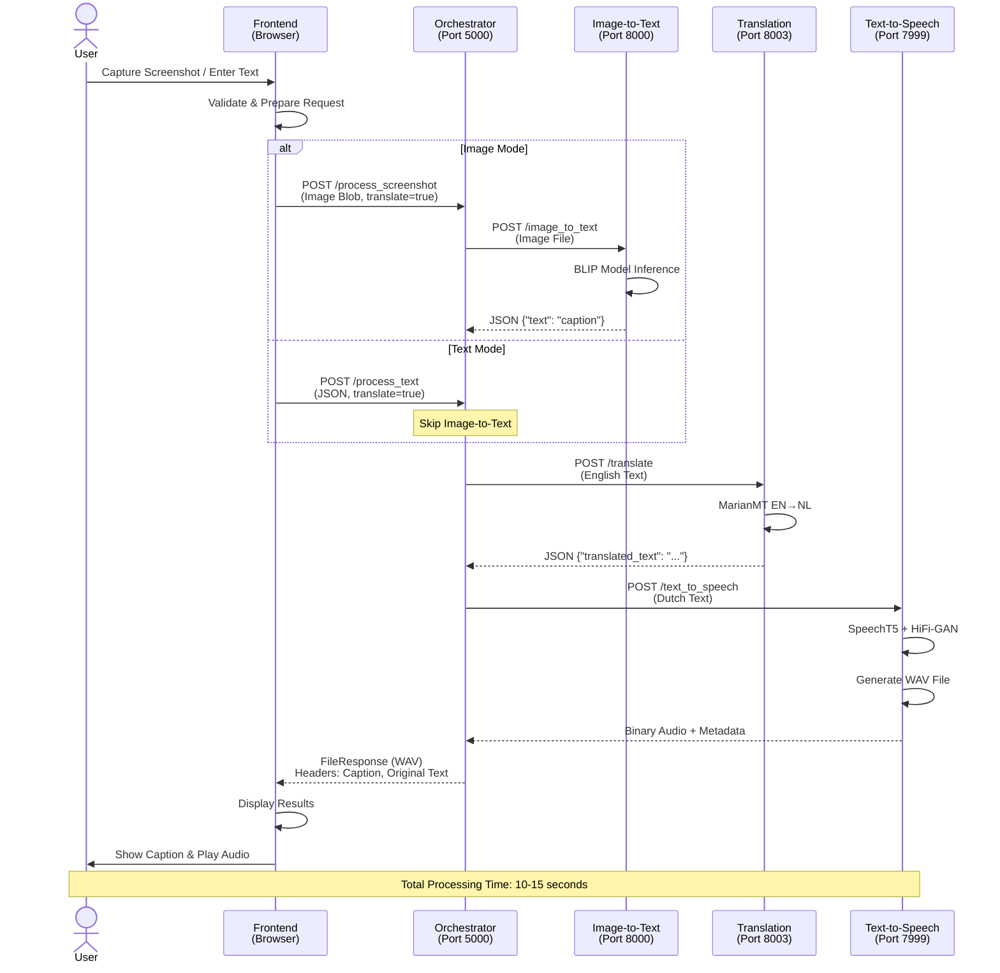
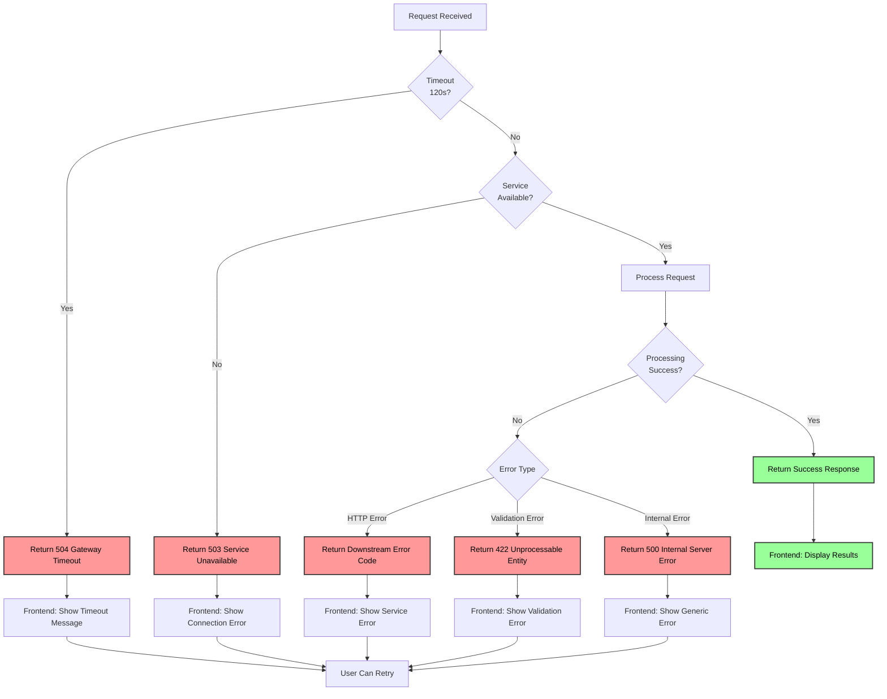

# SE Project: Multimodal AI Narration System

A production-grade microservices application that transforms visual and textual content into natural-sounding speech using state-of-the-art AI models. The system provides two modes: **Image Mode** for screenshot narration and **Text Mode** for direct text-to-speech conversion, with optional Dutch translation support.

## Project Overview

This system demonstrates a modern microservices architecture where specialized AI services work together to provide a seamless user experience. Users can capture screenshots or enter text, optionally translate content to Dutch, and receive natural audio narration—all through an intuitive web interface.

### Key Features

- **Image Mode**: Capture screenshots and receive AI-generated audio descriptions
- **Text Mode**: Enter text directly for instant speech synthesis
- **Translation**: Optional English-to-Dutch translation powered by MarianMT
- **Natural Speech**: High-quality speech synthesis using Microsoft SpeechT5
- **Containerized**: Fully containerized with Docker for easy deployment
- **Resilient**: Health checks, auto-restart, and graceful error handling
- **Modern Frontend**: TypeScript + Vite with real-time processing feedback

---

## System Architecture

### High-Level Architecture Diagram

```
┌──────────────────────────────────────────────────────────────────────┐
│                          USER INTERFACE                              │
│                                                                      │
│  ┌──────────────────────────────────────────────────────────────┐    │
│  │              Frontend (TypeScript/Vite + Nginx)              │    │
│  │                     Port: 3000                               │    │
│  │                                                              │    │
│  │  • Screenshot Capture (Screen Share API)                     │    │
│  │  • Text Input Interface                                      │    │
│  │  • Real-time Processing Feedback                             │    │
│  │  • Audio Playback                                            │    │
│  └───────────────────────┬──────────────────────────────────────┘    │
│                          │                                           │
└──────────────────────────┼───────────────────────────────────────────┘
                           │ HTTP/REST
                           │
┌──────────────────────────▼───────────────────────────────────────────┐
│                     ORCHESTRATION LAYER                              │
│                                                                      │
│  ┌──────────────────────────────────────────────────────────────┐    │
│  │                  Orchestrator (FastAPI)                      │    │
│  │                     Port: 5000                               │    │
│  │                                                              │    │
│  │  • Request Routing & Workflow Coordination                   │    │
│  │  • Service Health Monitoring                                 │    │
│  │  • Error Handling & Retry Logic                              │    │
│  │  • Response Aggregation                                      │    │
│  └───┬──────────────────┬──────────────────┬────────────────────┘    │
│      │                  │                  │                         │
└──────┼──────────────────┼──────────────────┼─────────────────────────┘
       │                  │                  │
       │ Image Data       │ Text (EN)        │ Text (EN/NL)
       │                  │                  │
┌──────▼──────────┐  ┌────▼─────────┐  ┌─────▼──────────────────┐
│                 │  │              │  │                        │
│  IMAGE-TO-TEXT  │  │ TRANSLATION  │  │   TEXT-TO-SPEECH       │
│    SERVICE      │  │   SERVICE    │  │      SERVICE           │
│                 │  │              │  │                        │
│  Port: 8000     │  │ Port: 8003   │  │    Port: 7999          │
│                 │  │              │  │                        │
│ ┌─────────────┐ │  │ ┌──────────┐ │  │  ┌─────────────┐       │
│ │    BLIP     │ │  │ │ MarianMT │ │  │  │  SpeechT5   │       │
│ │  Captioning │ │  │ │  EN→NL   │ │  │  │     TTS     │       │
│ │    Model    │ │  │ │Translation │  │  │    Model    │       │     
│ └─────────────┘ │  │ └──────────┘ │  │  └─────────────┘       │
│                 │  │              │  │                        │
│  Returns: Text  │  │Returns: Dutch│  │  ┌─────────────┐       │
│  (Description)  │  │     Text     │  │  │  HiFi-GAN   │       │
│                 │  │              │  │  │   Vocoder   │       │
└─────────────────┘  └──────────────┘  │  └─────────────┘       │
                                       │                        │
                                       │ Returns: WAV Audio     │
                                       └────────────────────────┘

┌─────────────────────────────────────────────────────────────────────┐
│                        INFRASTRUCTURE LAYER                         │
│                                                                     │
│  • Docker Compose Orchestration                                     │
│  • Shared Network: se_project_network                               │
│  • Volume Mounts: ./audio_files                                     │
│  • Health Checks: All services monitored                            │
│  • Auto-restart: On failure                                         │
└─────────────────────────────────────────────────────────────────────┘
```

---

## Processing Flow Diagrams

### Image Mode Workflow

```
┌─────────────┐
│    USER     │
│  (Browser)  │
└──────┬──────┘
       │ 1. Clicks "Capture Screenshot" or presses F9
       │
       ▼
┌─────────────────────────────────────────┐
│        Frontend (Browser API)           │
│  • Uses navigator.mediaDevices          │
│  • Captures screen via Screen Share API │
│  • Converts to PNG Blob                 │
└──────┬──────────────────────────────────┘
       │ 2. POST /api/process (multipart/form-data)
       │    Image Blob + translate flag
       ▼
┌─────────────────────────────────────────┐
│          Orchestrator Service           │
│  Step 1: Receive & Validate Image       │
└──────┬──────────────────────────────────┘
       │ 3. POST /image_to_text (Image)
       ▼
┌─────────────────────────────────────────┐
│       Image-to-Text Service             │
│  • Load image with PIL                  │
│  • Run BLIP model inference             │
│  • Extract descriptive caption          │
└──────┬──────────────────────────────────┘
       │ 4. Return: JSON {"text": "caption"}
       ▼
┌─────────────────────────────────────────┐
│          Orchestrator Service           │
│  Step 2: Process Caption Text           │
└──────┬──────────────────────────────────┘
       │
       │ [If translate=true]
       │ 5. POST /translate (EN text)
       ▼
┌─────────────────────────────────────────┐
│         Translation Service             │
│  • Tokenize English text                │
│  • Run MarianMT EN→NL model             │
│  • Return Dutch translation             │
└──────┬──────────────────────────────────┘
       │ 6. Return: JSON {"translated_text": "..."}
       ▼
┌─────────────────────────────────────────┐
│          Orchestrator Service           │
│  Step 3: Send to Speech Synthesis       │
└──────┬──────────────────────────────────┘
       │ 7. POST /text_to_speech (Text)
       ▼
┌─────────────────────────────────────────┐
│       Text-to-Speech Service            │
│  • Tokenize input text                  │
│  • Generate mel-spectrogram             │
│  • Vocoder converts to audio waveform   │
│  • Save as 16kHz WAV file               │
└──────┬──────────────────────────────────┘
       │ 8. Return: Binary WAV audio
       ▼
┌─────────────────────────────────────────┐
│          Orchestrator Service           │
│  • Attach caption in response headers   │
│  • X-Caption-Text: final text           │
│  • X-Original-Text: if translated       │
└──────┬──────────────────────────────────┘
       │ 9. Return: FileResponse (audio/wav)
       ▼
┌─────────────────────────────────────────┐
│              Frontend                   │
│  • Display screenshot preview           │
│  • Show caption text                    │
│  • Auto-play audio                      │
└─────────────────────────────────────────┘
```

### Text Mode Workflow

```
┌─────────────┐
│    USER     │
└──────┬──────┘
       │ 1. Types text & clicks "Generate Speech"
       │
       ▼
┌─────────────────────────────────────────┐
│              Frontend                   │
│  • Validates text input (non-empty)     │
└──────┬──────────────────────────────────┘
       │ 2. POST /api/process_text
       │    JSON: {"text": "..."} + translate flag
       ▼
┌─────────────────────────────────────────┐
│          Orchestrator Service           │
│  • Receive text input                   │
└──────┬──────────────────────────────────┘
       │
       │ [If translate=true]
       │ 3. POST /translate
       ▼
┌─────────────────────────────────────────┐
│         Translation Service             │
│  • Translate EN → NL                    │
└──────┬──────────────────────────────────┘
       │ 4. Return translated text
       ▼
┌─────────────────────────────────────────┐
│          Orchestrator Service           │
└──────┬──────────────────────────────────┘
       │ 5. POST /text_to_speech
       ▼
┌─────────────────────────────────────────┐
│       Text-to-Speech Service            │
│  • Generate audio from text             │
└──────┬──────────────────────────────────┘
       │ 6. Return WAV audio
       ▼
┌─────────────────────────────────────────┐
│          Orchestrator Service           │
│  • Attach caption metadata in headers   │
└──────┬──────────────────────────────────┘
       │ 7. Return audio file
       ▼
┌─────────────────────────────────────────┐
│              Frontend                   │
│  • Display text & translation           │
│  • Auto-play audio                      │
└─────────────────────────────────────────┘
```

---

## Mermaid User Flow Diagrams

### Complete User Journey - Image Mode



### Complete User Journey - Text Mode



### Service Interaction Flow - With Translation



### Error Handling Flow



---

## Service Components

### 1. Frontend Service
**Technology Stack**: TypeScript, Vite, Axios, HTML5/CSS3, Nginx  
**Port**: 3000  
**Container**: `frontend-service`

**Responsibilities**:
- User interface rendering and interaction handling
- Screenshot capture using Browser Screen Share API
- Text input validation and submission
- Real-time processing status visualization (4 steps)
- Audio playback with native HTML5 controls
- Translation toggle and mode switching (Image/Text)
- F9 hotkey support for quick screenshot capture

**Key Files**:
- `frontend/src/main.ts` - Main application logic
- `frontend/index.html` - UI structure and styling
- `frontend/vite.config.ts` - Build configuration with API proxy
- `frontend/nginx.conf` - Production server configuration

---

### 2. Orchestrator Service
**Technology Stack**: Python, FastAPI, httpx, Uvicorn  
**Port**: 5000  
**Container**: `orchestrator-service`

**Responsibilities**:
- Central coordination hub for all AI services
- Request routing and workflow management
- Service discovery via environment variables
- Health monitoring of downstream services
- Error handling and timeout management (120s)
- Response aggregation and metadata injection
- CORS configuration for frontend access

**API Endpoints**:
- `GET /` - Service status information
- `GET /health` - Comprehensive health check (all services)
- `POST /process_screenshot` - Image processing workflow
- `POST /process_text` - Text-only processing workflow

**Environment Variables**:
```
IMAGE_TO_TEXT_URL=http://image-to-text:8000
TEXT_TO_SPEECH_URL=http://text-to-speech:7999
TRANSLATION_URL=http://translation:8003
```

---

### 3. Image-to-Text Service
**Technology Stack**: Python, Transformers, PyTorch, PIL, FastAPI  
**Port**: 8000  
**Container**: `image-to-text-service`

**AI Model**: Salesforce BLIP (Bootstrapping Language-Image Pre-training)  
**Model Size**: ~990MB

**Responsibilities**:
- Image preprocessing and validation
- Caption generation using BLIP base model
- Multi-format image support (PNG, JPEG, etc.)
- Model inference optimization

**Technical Details**:
- Uses `transformers.pipeline("image-to-text")`
- Accepts multipart/form-data uploads
- Returns JSON with generated caption
- Automatic model download on first run

---

### 4. Translation Service
**Technology Stack**: Python, Transformers, PyTorch, FastAPI  
**Port**: 8003  
**Container**: `translation-service`

**AI Model**: Helsinki-NLP MarianMT (opus-mt-en-nl)  
**Model Size**: ~312MB

**Responsibilities**:
- English to Dutch translation
- Text tokenization and preprocessing
- Translation model inference
- Supports up to 512 tokens per request

**Technical Details**:
- Model loaded on service startup
- Handles truncation for long texts
- Returns both original and translated text
- Health endpoint for monitoring

---

### 5. Text-to-Speech Service
**Technology Stack**: Python, Transformers, PyTorch, SoundFile, FastAPI  
**Port**: 7999  
**Container**: `text-to-speech-service`

**AI Models**: 
- Microsoft SpeechT5 TTS (~500MB)
- HiFi-GAN Vocoder (~350MB)

**Responsibilities**:
- Text tokenization and phoneme conversion
- Mel-spectrogram generation via SpeechT5
- Waveform synthesis using HiFi-GAN vocoder
- WAV file creation (16kHz, mono)
- Audio file cleanup (keeps last 10 files)

**Technical Details**:
- Random speaker embedding for voice consistency
- Timestamped filenames for unique identification
- Automatic cleanup of old audio files
- Direct file response (streaming)

---

## Technology Stack

### AI/ML Framework
- **Transformers** (4.39.0+): Hugging Face library for model inference
- **PyTorch** (2.1.0+): Deep learning framework
- **TorchVision** (0.16.0+): Image processing utilities

### Backend Services
- **FastAPI**: Modern async Python web framework
- **Uvicorn**: ASGI server for FastAPI applications
- **httpx**: Async HTTP client for service communication
- **Pydantic**: Data validation and serialization

### Frontend
- **TypeScript**: Type-safe JavaScript
- **Vite**: Fast build tool and dev server
- **Axios**: Promise-based HTTP client
- **Nginx**: Production web server

### DevOps
- **Docker & Docker Compose**: Containerization and orchestration
- **Multi-stage builds**: Optimized image sizes
- **Health checks**: Service monitoring
- **Bridge networking**: Inter-container communication

### Additional Libraries
- **PIL (Pillow)**: Image processing
- **SoundFile**: Audio file I/O
- **SentencePiece**: Text tokenization
- **python-multipart**: File upload handling

---

## Project Structure

```
se_project/
├── docker-compose.yml              # Multi-container orchestration
├── requirements.txt                # Shared Python dependencies
├── README.md                       # This file
│
├── frontend/                       # Frontend service
│   ├── Dockerfile                  # Multi-stage build (Node + Nginx)
│   ├── index.html                  # Main HTML with inline CSS
│   ├── nginx.conf                  # Nginx reverse proxy config
│   ├── package.json                # NPM dependencies
│   ├── tsconfig.json               # TypeScript configuration
│   ├── vite.config.ts              # Vite build & proxy config
│   └── src/
│       └── main.ts                 # Main TypeScript application
│
├── orchestrator/                   # Orchestration service
│   ├── Dockerfile                  # Python service container
│   ├── orchestrator.py             # Main FastAPI application
│   └── requirements.txt            # Service dependencies
│
├── image_to_text/                  # Image captioning service
│   ├── Dockerfile                  # Python + ML models
│   ├── image_to_text.py            # BLIP inference service
│   └── requirements.txt            # Service dependencies
│
├── translation_model/              # Translation service
│   ├── Dockerfile                  # Python + MarianMT
│   ├── translation.py              # Translation API
│   ├── requirements.txt            # Service dependencies
│   ├── test_translation.py         # Service tests
│   ├── README.md                   # Service documentation
│   └── SETUP_COMPLETE.md           # Setup verification
│
├── text_to_speech/                 # Speech synthesis service
│   ├── Dockerfile                  # Python + TTS models
│   ├── text_to_speech.py           # SpeechT5 inference service
│   └── requirements.txt            # Service dependencies
│
└── audio_files/                    # Generated audio storage
    └── output_speech_*.wav         # Timestamped audio files
```

---

## Quick Start Guide

### Prerequisites

- **Docker**: Version 20.10+ ([Install Docker](https://docs.docker.com/get-docker/))
- **Docker Compose**: Version 2.0+ ([Install Compose](https://docs.docker.com/compose/install/))
- **System Requirements**: 
  - 8GB RAM minimum (4GB for AI models, 4GB for system)
  - 5GB free disk space (for Docker images and models)
  - Modern CPU (multi-core recommended for faster inference)

### Installation & Setup

1. **Clone the repository**
   ```bash
   git clone <repository-url>
   cd se_project
   ```

2. **Start all services**
   ```bash
   docker-compose up --build
   ```
   
   **Note**: First startup takes 5-10 minutes as Docker builds images and downloads AI models (~2GB total).

3. **Verify services are healthy**
   
   Wait for these messages in the logs:
   ```
   frontend-service        | ready
   orchestrator-service    | INFO: Uvicorn running on http://0.0.0.0:5000
   image-to-text-service   | INFO: Uvicorn running on http://0.0.0.0:8000
   translation-service     | Model loaded successfully!
   text-to-speech-service  | INFO: Uvicorn running on http://0.0.0.0:7999
   ```

4. **Access the application**
   - **Frontend UI**: http://localhost:3000
   - Orchestrator API: http://localhost:5000
   - Image-to-Text API: http://localhost:8000
   - Translation API: http://localhost:8003
   - Text-to-Speech API: http://localhost:7999

### Using the Application

#### Image Mode
1. Open http://localhost:3000
2. Ensure "Image Mode" is selected
3. Click "Capture Screenshot" or press **F9**
4. Select a window/screen to capture in the browser dialog
5. Watch the processing steps complete
6. View the generated caption and listen to the audio

#### Text Mode
1. Switch to "Text Mode" via the toggle
2. Enter your text in the textarea
3. (Optional) Check "Translate to Dutch"
4. Click "Generate Speech"
5. Listen to the generated audio

---

## API Documentation

### Orchestrator Service (`localhost:5000`)

#### `GET /`
Returns service information and available endpoints.

**Response**:
```json
{
  "service": "Screenshot Orchestrator",
  "status": "running",
  "endpoints": {
    "health": "/health",
    "process": "/process_screenshot (POST)"
  }
}
```

#### `GET /health`
Checks health status of all downstream services.

**Response**:
```json
{
  "orchestrator": "healthy",
  "image_to_text": "healthy",
  "text_to_speech": "healthy",
  "translation": "healthy",
  "timestamp": "2025-12-01T10:30:00.000000+00:00"
}
```

#### `POST /process_screenshot?translate=false`
Main image processing workflow endpoint.

**Request**:
- Content-Type: `multipart/form-data`
- Body: `file` (image file)
- Query: `translate` (boolean, default: false)

**Response**:
- Content-Type: `audio/wav`
- Headers:
  - `X-Caption-Text`: Generated or translated caption
  - `X-Original-Text`: Original English caption (if translated)
  - `X-Translated`: "true" if translation occurred

#### `POST /process_text?translate=false`
Text-only processing endpoint.

**Request**:
```json
{
  "text": "Your text here"
}
```

**Response**: Same as `/process_screenshot`

---

### Image-to-Text Service (`localhost:8000`)

#### `POST /image_to_text`
Generates caption from uploaded image.

**Request**:
- Content-Type: `multipart/form-data`
- Body: `file` (image file)

**Response**:
```json
{
  "text": "a person sitting at a desk with a laptop"
}
```

---

### Translation Service (`localhost:8003`)

#### `GET /health`
Service health check.

**Response**:
```json
{
  "status": "healthy",
  "model_loaded": true
}
```

#### `POST /translate`
Translates English text to Dutch.

**Request**:
```json
{
  "text": "Hello world",
  "source_lang": "en",
  "target_lang": "nl"
}
```

**Response**:
```json
{
  "original_text": "Hello world",
  "translated_text": "Hallo wereld",
  "source_lang": "en",
  "target_lang": "nl"
}
```

---

### Text-to-Speech Service (`localhost:7999`)

#### `POST /text_to_speech`
Converts text to speech audio.

**Request**:
```json
{
  "text": "This is a test"
}
```

**Response**:
- Content-Type: `audio/wav`
- Body: Binary WAV file (16kHz, mono)

---

## Performance Considerations

### Model Inference Times (CPU)
- **Image Captioning**: 2-5 seconds
- **Translation**: 1-2 seconds
- **Speech Synthesis**: 3-8 seconds
- **Total (with translation)**: ~10-15 seconds

---

## 📝 AI Models Attribution

This project uses the following open-source AI models:

- **BLIP Image Captioning**: [Salesforce/blip-image-captioning-base](https://huggingface.co/Salesforce/blip-image-captioning-base)
  - License: BSD-3-Clause
  - Paper: [BLIP: Bootstrapping Language-Image Pre-training](https://arxiv.org/abs/2201.12086)

- **MarianMT Translation**: [Helsinki-NLP/opus-mt-en-nl](https://huggingface.co/Helsinki-NLP/opus-mt-en-nl)
  - License: Apache 2.0
  - Project: [OPUS-MT](https://github.com/Helsinki-NLP/Opus-MT)

- **SpeechT5 TTS**: [microsoft/speecht5_tts](https://huggingface.co/microsoft/speecht5_tts)
  - License: MIT
  - Paper: [SpeechT5: Unified-Modal Encoder-Decoder Pre-training](https://arxiv.org/abs/2110.07205)

- **HiFi-GAN Vocoder**: [microsoft/speecht5_hifigan](https://huggingface.co/microsoft/speecht5_hifigan)
  - License: MIT
  - Paper: [HiFi-GAN: Generative Adversarial Networks for Efficient and High Fidelity Speech Synthesis](https://arxiv.org/abs/2010.05646)

---

## 📜 License

MIT License - See LICENSE file for details

---

## 🙏 Acknowledgments

- Hugging Face for the Transformers library and model hosting
- Salesforce Research for BLIP model
- Microsoft Research for SpeechT5 and HiFi-GAN
- Helsinki-NLP for MarianMT translation models
- FastAPI and Vite communities for excellent frameworks

---

**Built with ❤️ using Docker, FastAPI, Transformers, and TypeScript**

*Last Updated: December 2025*
